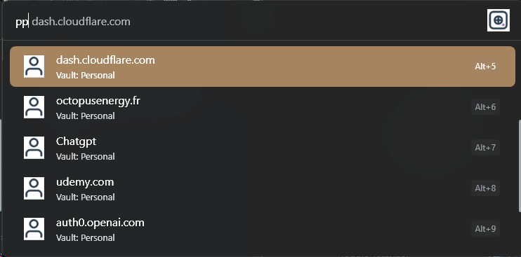
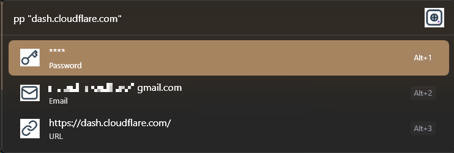

# Flow Launcher Plugin — Proton Pass

[](https://github.com/Flow-Launcher/Flow.Launcher)
[](LICENSE)

A [Flow Launcher](https://github.com/Flow-Launcher/Flow.Launcher) plugin for quick access to your [Proton Pass](https://proton.me/pass) credentials via the `pass-cli` command-line interface. Entries title and id are cached at startup for fast search. Details are loaded on demand and not cached.

## Features

- **Search logins** — type `pp <search>` to find credentials across your vaults
- **Multi-vault support** — cache and search across all your Proton Pass vaults
- **Vault switching** — use `@VaultName` to scope your search to a specific vault
- **All vaults mode** — use `@*` to search everything at once
- **Vault names with spaces** — use `@"My Vault"` syntax
- **Copy to clipboard** — click a field (email, username, password, etc.) to copy it
- **Open URLs** — click a URL to open it in your browser
- **Refresh cache** — re-fetch all vaults and items on demand
- **Configurable result limit** — control how many results are shown
- **Stay-open mode** — keep Flow Launcher open after copying multiple fields

## Requirements

- [Flow Launcher](https://github.com/Flow-Launcher/Flow.Launcher) v1.9+
- [Proton Pass CLI](https://github.com/ProtonPass/pass-cli) (`pass-cli`) installed and authenticated
- Windows (Flow Launcher requirement)

## Installation

### Via Flow Launcher
!! ⚠ Plugin not in store yet

1. ~~Open Flow Launcher (`Alt+Space`)~~
2. ~~Type `pm install ProtonPass` and press Enter~~
3. ~~The plugin will be installed automatically~~


### Manual
1. Download the latest release from the [Releases page](https://github.com/sruaudgit/Flow.Launcher.Plugin.ProtonPass/releases)
2. Extract to `%APPDATA%\FlowLauncher\Plugins\ProtonPass`
3. Restart Flow Launcher

## Preview






## Quick Start

1. Make sure `pass-cli` is authenticated (`pass-cli test`)
2. Open Flow Launcher (`Alt+Space`)
3. Type `pp` to see all logins in your default vault
4. Type `pp github` to search for GitHub credentials
5. Click a result to see its details (email, username, password, URLs, extra fields)
6. Click any field to copy its value

## Usage

### Action keyword

The default action keyword is `pp`. Type `pp` followed by your search query:

```
pp                        → list all items in default vault
pp github                 → search for "github" in default vault
pp "My Login"             → exact match search
```

### Vault selection

Use `@` to select a vault:

```
pp @                      → show vault list (select one to continue)
pp @Personal              → show all items in Personal vault
pp @Personal github       → search "github" in Personal vault
pp @*                     → search all vaults
pp @* github              → search "github" in all vaults
pp @"My Family"           → show all items in a vault with spaces in its name
pp @"My Family" github    → search "github" in a vault with spaces
```

When only one vault exists, typing `pp @` automatically selects it.

### Item details

When a single item matches, the plugin shows its details:

| Field | Icon | Action |
|-------|------|--------|
| Email | envelope | Copy to clipboard |
| Username | person | Copy to clipboard |
| Password | key (masked as `****`) | Copy to clipboard |
| URL | link | Open in browser |
| Extra fields | key | Copy to clipboard |

### Keyboard shortcuts

- `Enter` on a login → show detail / copy
- `Esc` → go back / close

## Settings

| Setting | Default | Description |
|---------|---------|-------------|
| **Default vault** | `Personal` | Vault searched when no `@` prefix is used |
| **Max results** | `10` | Maximum number of results shown per query |
| **Keep Flow Launcher open** | `On` | Stay open after copying a field or opening a URL (useful for copying username + password in sequence) |

Settings can be changed via Flow Launcher's settings panel for this plugin.

## CLI Dependencies

This plugin relies on `pass-cli` from Proton. 
The following commands are used:

| Command                                                                | Purpose               |
| ------------------------------------------------------------------------| -----------------------|
| `pass-cli test`                                                        | Check authentication  |
| `pass-cli vault list --output json`                                    | List all vaults       |
| `pass-cli item list "<vault>" --output json`                           | List items in a vault |
| `pass-cli item view --output json --item-id <id> --share-id <shareId>` | View item details     |

## Troubleshooting

### "Not authenticated" message
Run `pass-cli login` in a terminal to authenticate, then try again.

### Clipboard errors
If you see a clipboard error, another application may be holding the clipboard. Try again or close the competing application.

### Vault not found
If `@VaultName` returns no results, check the exact vault name. Use `pp @` to see all available vaults.

### Cache is outdated
Click the "Refresh Proton Pass Cache" result (shown at the top when `pp` is typed with no query) to re-fetch all items.

## Building from Source

```bash
git clone https://github.com/sruaudgit/Flow.Launcher.Plugin.ProtonPass
cd Flow.Launcher.Plugin.ProtonPass
dotnet publish
```

The built plugin will be in `bin\Release\publish`. 
Make a zip file with the content of the directory and install with plugin manager in Flow Launcher `pm install <path to the zip>`.

## RoadMap
* handle A2F token/totp
* this is a search only tool, i have no plan to create/delete entries

## License

This project is licensed under the MIT License — see the [LICENSE](LICENSE) file for details.
